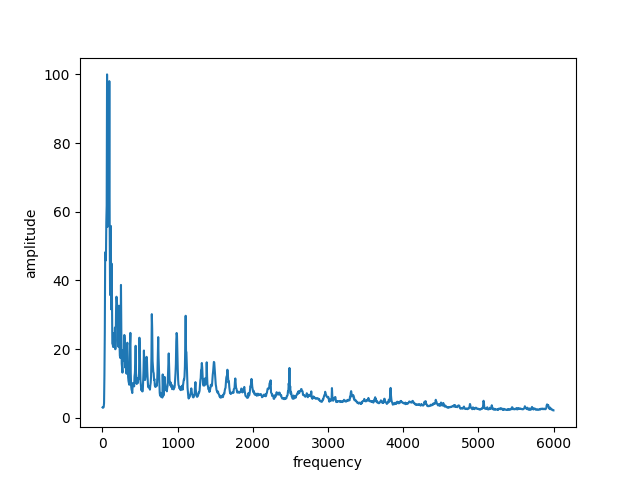
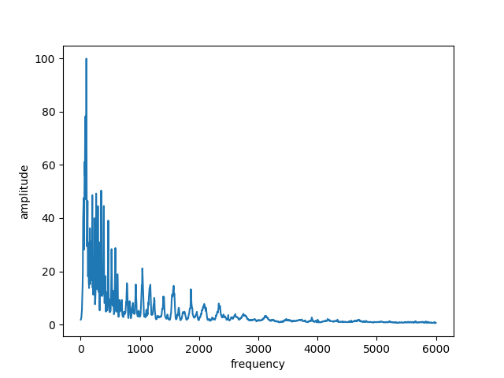
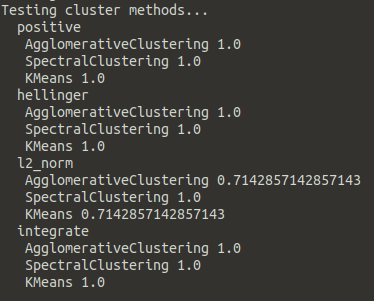

Example with plotting
=======================

After running `python example.py`, it loads the configuration
from `config.ini` and from the folder `song/`. After
executing it, we can see the fourier series in the folder `image/`
saved using the functions from
`foucluster.plot`.

*Higher and Higher* from *Scream Inc* is a rock song.

*Secret mission* from *Frank Rawel* is a jazz song.

The distance matrix can be plot as a heat map

.. image:: image/integrate.png

where the dark values means the songs are closer and
white means the distances are high.

Using only the deterministic cluster algorithms (the ones in which
you need to introduce the number of clusters; we introduced 2 for
the example),

